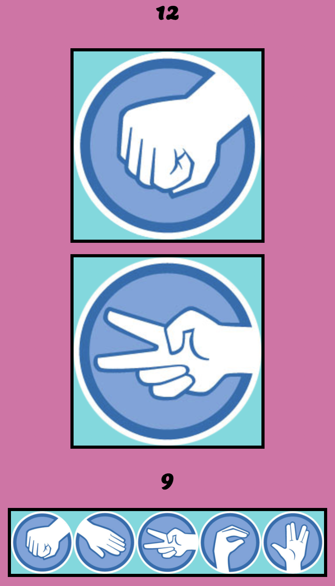
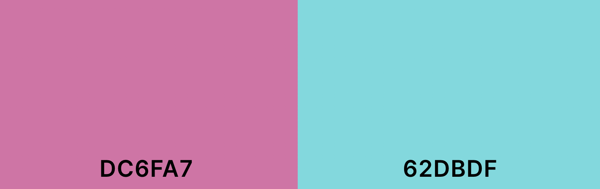
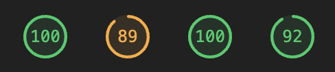

# RPSLS

<!-- TOC -->

- [RPSLS](#rpsls)
  - [**Project Description**](#project-description)
  - [Rock Paper Scissors More! is a simple but fun interactive webgame for users to pass the time with.]
  - [**Features**](#features)
    - [**Existing Features**](#existing-features)
  - [**Design**](#design)
    - [**Fonts**](#fonts)
    - [**Colors**](#colors)
  - [**Testing**](#testing)
  - [**Validation**](#validation)
  - [**Bugs**](#bugs)
    - [**Discovered Bugs**](#discovered-bugs)
  - [**Deployment**](#deployment)
  - [**Credits**](#credits)
  - [**Contact**](#contact)

<!-- /TOC -->

---

## **Project Description**

---

Rock Paper Scissors More! is a simple but fun interactive webgame for users to pass the time with.

## **Features**

---

### **Existing Features**

- Fully responsive for all device sizes

- User friendly interface -

- Stylish images

- Random generation bot to play against

---

## **Design**

---

### **Fonts**

- I used google fonts to import 1 font. This was _Lemon_ which I used to match the nature of the games laid back and non-serious feel.

### **Colors**

- I used <https://coolors.co/> to create my color palette.

- Primary Color

  - Thulian Pink (#DC6FA7)
  - I used this pink in harmony with the secondary to give the page a friendly and relaxing feel.

- Secondary Color

  - Tiffany Blue (#62DBDF)
  - The relaxing feeling of these 2 colors represents the laid back nature of the game of rock paper scissors.

## **Testing**

---

I began testing after deploying the website. From here I made sure all my images loaded and fixed a couple broken file paths

I tested each selection 100 times and kept track of the scoreboard to make sure it updated accordingly

---

## **Validation**

---

- HTML validated using <https://validator.w3.org/>
  - Errors were found on  elements. This was done intentionally as source was later imported with javascript not on load.
- CSS validated using <https://jigsaw.w3.org/css-validator/>
  - No mistakes were found
- JS validated at <https://jshint.com/>
  - No errors were found
- Page performance validated using lighthouse
  - Results were as follows

---

## **Bugs**

---

### **Discovered Bugs**

- Broken file paths to images on deployed site
  - Fixed by changing absolute file paths to relative

---

## **Deployment**

---

The website was deployed by pushing to Github and using the pages feature and can be viewed at <https://22kszov.github.io/rpsls-ci/>

- Deployment instructions

  - Navigate to the repository
  - Select 'Actions' from the side navigation menu
  - Select the most recent 'pages build and deployment' option
  - From the workflow tree click the link under the 'deploy' heading

- You can clone this repositary by:
  - Going to <https://github.com/22kszov/rpsls-ci> and clicking the code dropdown.
  - From local select the HTTPS link and copy it
  - Open Vscode
  - Connect your Github
  - Clone repository using HTTPS link

---

## **Credits**

---

- All images sourced from devpost.com
- Images edited with GIMP
- All images compressed using image.compressor.com
- All fonts sourced from fonts.google.com
- Color palette created using coolors.co
- Markdown Table of Contents generated using the Auto Markdown TOC extension

---

## **Contact**

---

For any queries and information you can contact me at my email address 22kszov@gmail.com
